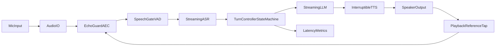

# Real-Time Local Voice Assistant (Python-Only, OSS)

Fully local voice assistant for real-time conversations with barge-in support.
Designed for mixed hardware (low-end CPU devices through higher-end machines)
using adaptive runtime profiles and open-source components only.

## Core Design Goals

- Fully local pipeline: `ASR -> LLM -> TTS` (no cloud dependency required)
- Reliable barge-in without self-interruption from assistant playback
- Low-latency streaming response path
- Cross-device profile strategy (`low`, `mid`, `high`)
- Open-source/free-license tooling only

## Architecture



## Key Runtime Components

- `utils/audio.py`
  - `NLMSEchoCanceller`: adaptive echo cancellation
  - `EchoGuard`: playback reference alignment + echo similarity gate
  - `SpeechGate`: threshold/noise gating
  - `BargeInDetector`: score-based interrupt confirmation
- `utils/dialogue_controller.py`
  - explicit turn state machine:
    - `idle`
    - `assistant_speaking`
    - `user_takeover`
    - `recover`
- `main.py`
  - streaming orchestration
  - cancellation propagation across LLM/TTS on confirmed barge-in
  - profile/config validation and stage-latency markers
- `utils/transports.py`
  - `SessionMux` with `local_lan` / `webrtc` / `hybrid` modes
  - transport envelopes for session events
- `utils/capabilities.py`
  - OVOS-style capability registry (`system.time`, plugin providers)

## Open-Source License Matrix

Use model licenses that are compatible with your deployment needs.

| Layer | Tool/Runtime | License |
|---|---|---|
| VAD | Silero VAD | MIT |
| AEC | In-repo NLMS implementation | MIT (project license) |
| STT | faster-whisper | MIT |
| STT (streaming) | whisper.cpp / pywhispercpp | MIT |
| LLM runtime | Ollama | MIT |
| TTS | kokoro-onnx | Apache-2.0 |
| TTS alt | Supertonic | Open-source (check pinned version license) |
| Audio IO | sounddevice / PortAudio | MIT / permissive |
| DSP numeric | NumPy | BSD-3-Clause |

## TTS / no audio from speakers?

See [docs/TTS.md](docs/TTS.md). Quick check:

```bash
python scripts/test_tts_playback.py
```

Set `output_device` in `config.json` to the same PortAudio index as your headphones (from `python main.py --list-devices`).

## Quick Start

### 1) Install

```bash
pip install -r requirements.txt
```

### 2) Prepare local models

```bash
ollama serve
ollama pull llama2
ollama pull tinyllama
```

### 3) Run

```bash
python main.py --profile mid
```

## Device Profiles

- `low`
  - STT: `tiny`
  - LLM: `tinyllama`
  - lower AEC filter for CPU budget
- `mid` (default)
  - STT: `base`
  - LLM: `llama2`
- `high`
  - STT: `small`
  - LLM: `llama3`
  - longer AEC filter for tougher acoustic paths

Backwards-compatible aliases:
- `desktop` -> `mid`
- `server` -> `high`

## Runtime Compute Profiles

- `edge`
  - STT path prefers `whispercpp`
  - conservative generation settings
- `balanced` (default)
  - mixed latency/quality profile
- `max_quality`
  - larger generation budgets and quality-biased settings

## Transport Modes

- `local_lan`
  - local/LAN service transport path
- `webrtc`
  - WebRTC session-oriented transport
- `hybrid`
  - both transports active

## Important Runtime Flags

```bash
python main.py --mode controller
python main.py --profile low
python main.py --runtime-profile edge --transport-mode hybrid
python main.py --barge-in-debug
python main.py --aec-filter-ms 120 --echo-corr-threshold 0.5
python main.py --wakeword-enabled --wakeword "hey_jarvis" --wakeword-threshold 0.55
python main.py --list-wakewords
python main.py --wakeword-enabled --wakeword "hey_jarvis" --wakeword-service-mode process
python main.py --speaker-verify-enabled --speaker-enrollment-wav ./voice_enroll.wav
python main.py --wakeword-policy hybrid_recovery --wakeword-miss-limit 80 --wakeword-recovery-window-sec 3.0
python main.py --enroll-speaker ./voice_enroll.wav --enroll-duration-sec 6
# if needed, pin input device and let enrollment auto-pick supported sample rate:
python main.py --list-devices
python main.py --input-device 4 --enroll-speaker ./voice_enroll.wav
python main.py --diagnostics-log-path ./logs/bargein.jsonl --diagnostics-log-frames
```

## Barge-In Tuning Guide

If assistant still interrupts itself:

- Increase `echo_corr_threshold` (example: `0.45 -> 0.60`)
- Increase `barge_in_min_delay_after_ref_sec` (example: `0.7 -> 0.9`)
- Increase `barge_in_min_rms_ratio` (example: `3.0 -> 3.5`)
- Prefer headset during baseline validation
- Re-run startup calibration in a quiet room

If barge-in is too hard:

- Decrease `barge_in_min_rms_ratio`
- Decrease `barge_in_min_speech_sec`
- Keep echo gates enabled, adjust gradually

## Configuration

Edit `config.json` for defaults:

- `profile`
- `runtime_profile`
- `transport_mode`
- `local_only`
- `streaming_llm`
- `chunked_tts`
- `aec_filter_ms`
- `echo_corr_threshold`
- `wakeword_enabled`, `wakeword`, `wakeword_threshold`, `wakeword_timeout_sec`, `wakeword_model_path`
- `wakeword_service_mode`, `wakeword_policy`, `wakeword_miss_limit`, `wakeword_recovery_window_sec`
- `speaker_verify_enabled`, `speaker_enrollment_wav`, `speaker_verify_threshold`
- `diagnostics_log_path`, `diagnostics_log_frames`
- controller tuning keys (`controller_*`)

## Wakeword Policies

- `strict_required`
  - ASR only starts after a valid wakeword event.
- `hybrid_recovery`
  - strict wakeword first, then opens a short fallback window after repeated misses.
- `legacy_compatible`
  - bypasses wakeword gate for backward compatibility/testing.

## Diagnostics Components

With `--diagnostics-log-path`, logs include component tags:

- `wakeword`: gate events, detections, recovery windows
- `audio`: recorder state transitions and frame gate outcomes
- `policy_decision`: layered interruption allow/block reasons
- `listener_state`: TTS/listener state transitions
- `turn_detector`: partial/final transcript turn signals

## Benchmark Harness

Run reproducible synthetic latency benchmarks:

```bash
python benchmarks/benchmark_realtime.py --stt-model tiny --llm-model tinyllama --tts-backend kokoro
python benchmarks/benchmark_realtime.py --runtime-profile balanced --transport-mode local_lan --enforce-slo
```

Report output:

- `benchmarks/last_report.json`
- per-scenario values:
  - `capture_to_stt_ms`
  - `llm_first_sentence_ms`
  - `tts_total_ms`
  - `estimated_interrupt_stop_ms`

## Tests

```bash
python -m pytest tests -q
```

Includes:

- audio/AEC regression tests
- self-echo false barge-in tests
- controller state-machine tests
- profile validation/budget guard tests
- transport and capability adapter tests
- replay-style barge-in reliability tests

## Architecture Docs

- `docs/architecture.md`
- `docs/deployment_profiles.md`

## Troubleshooting

- `No audio device`:
  - run `python main.py --list-devices`
  - set explicit input/output device IDs
- `LLM unavailable`:
  - ensure `ollama serve` is running
  - ensure model is downloaded
- `Slow first response`:
  - use `--profile low`
  - keep `streaming_llm=true` and `chunked_tts=true`
- `Still getting self-barge-in`:
  - enable `--barge-in-debug`
  - verify echo gate values and calibration environment

## License

Project license: MIT.
