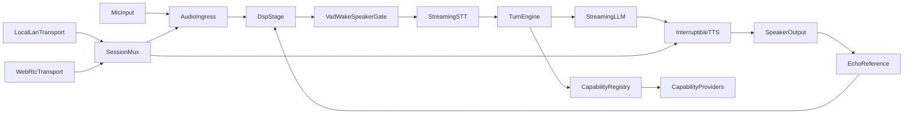

# Unified OSS Voice Agent Architecture

## Overview

The runtime uses one Python core with adapter layers inspired by:

- Wyoming-style service boundaries for local/LAN device interoperability
- OVOS-style capability registry for plugin-like extensions
- Pipecat-style interruption/turn strategies
- LiveKit-style session/transport abstraction for WebRTC-ready profiles

For the next architecture layer that supports always-on listening, modes, and
long-running assistant/search/research tasks, see
[`always_on_agent_layer.md`](always_on_agent_layer.md).

## Core Graph

## Runtime Layers

- `main.py`
  - orchestration lifecycle
  - profile + transport bootstrap
  - cancellation propagation
- `utils/audio.py`
  - `EchoGuard`, `SpeechGate`, `BargeInDetector`
  - listener FSM states: `idle`, `armed`, `listening`, `assistant_speaking`, `recover`
- `utils/wakeword_service.py`
  - wakeword service boundary adapters (`local`, `process`) with local fallback
- `utils/dialogue_controller.py`
  - state machine + layered interruption policies
- `utils/interruption_policies.py`
  - timing, duration, echo, transcript, and voiced/energy policy layers
- `utils/turn_detector.py`
  - turn detection interface for partial/final transcript routing
- `utils/transports.py`
  - `SessionMux`, `TransportMode`, transport adapters
- `utils/capabilities.py`
  - capability plugin registry

## Interruption Strategy Modes

- `strict_echo_protect`
  - safest against self-barge-in
  - higher confidence required to interrupt
- `balanced`
  - default
  - mixed latency and reliability
- `aggressive_user_takeover`
  - fastest user takeover
  - potentially more false interrupts in noisy rooms

## Transport Modes

- `local_lan`
  - local and LAN-first deployment
- `webrtc`
  - browser/phone realtime session profile
- `hybrid`
  - both local/LAN and WebRTC enabled

## Wakeword Runtime Modes

- `wakeword_service_mode=local`
  - wakeword detection in-process.
- `wakeword_service_mode=process`
  - wakeword detection in a separate process boundary (Wyoming-style service separation pattern).

## Wakeword Policies

- `strict_required`
  - requires wakeword before user speech capture.
- `hybrid_recovery`
  - strict gating with bounded fallback recovery windows on repeated misses.
- `legacy_compatible`
  - compatibility mode with wakeword gate bypass.
