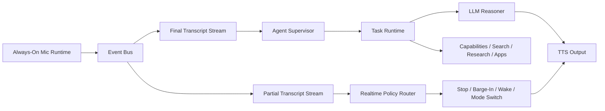

# Always-On Agent Layer

> ⚠️ **Historical record (point-in-time).** Superseded by [`docs/unified_architecture.md`](../unified_architecture.md) and the current [`.agents/backlog.md`](../.agents/backlog.md). Kept for history. (2026-06-02 consolidation.)

> **Status — design rationale (historical).** This doc captured *why* the brain
> exists and is kept for that reasoning. Two things have since changed: the
> "current code" it points at (`utils/audio.py`, `utils/stt.py`,
> `utils/dialogue_controller.py`, `utils/wakeword_service.py`, …) was the
> hand-rolled engine and is now **deleted** — replaced by **`sherpa-onnx`** in
> `core/engines/sherpa.py`; and the proposed supervisor/event-bus/task-runtime
> now **exists** in `always_on_agent/` (see the *Prototype Status* section).
> For how things are wired today read [`architecture.md`](../architecture.md); for
> the roadmap read [`target_architecture.md`](../target_architecture.md).

## Short Recommendation

Keep Python for the audio and agent runtime. Do not rewrite the current project
in another language yet. The repo already depends on Python-first OSS speech
tooling, and the existing tests cover Python components.

The change that matters is architectural: move from one large voice loop in
`main.py` to a small event-driven supervisor above the existing pipeline.

Use the current code as the local audio engine:

- mic capture, AEC, VAD, wake word, speaker verification: `utils/audio.py`,
  `utils/voice_gate.py`, `utils/wakeword_service.py`
- partial and final STT: `utils/stt.py`
- turn/interruption state: `utils/dialogue_controller.py`,
  `utils/interruption_policies.py`, `utils/turn_detector.py`
- LLM/TTS: `utils/llm.py`, TTS code paths in `utils/audio.py`
- local tool hooks: `utils/capabilities.py`
- deterministic routing: `utils/conversation_router.py`

Add one layer above it:



## Why the Current Shape Will Fight You

The current architecture is feasible for a single assistant, but it will become
hard to extend into multiple modes because `main.py` owns too many concerns:

- audio lifecycle
- partial STT worker
- interruption policy
- LLM generation
- TTS queueing
- capability execution
- transport/session events
- console/UI output

This is already visible around the partial transcription path:
`_partial_transcribe_loop` receives audio, transcribes it, prints it, updates
the controller, updates turn detection, routes control phrases, and may execute
shutdown/stop actions. That is too much responsibility for one loop if you want
assistant/search/research modes.

## Proposed Runtime Pieces

### 1. Audio Engine

Responsible only for always-on listening and speech events.

Outputs:

- `audio.speech_start`
- `audio.speech_end`
- `stt.partial`
- `stt.final`
- `barge_in.confirmed`
- `wake.detected`
- `speaker.verified`
- `tts.started`
- `tts.finished`

This layer should stay close to the existing repo code.

### 2. Realtime Policy Router

Fast deterministic path. It must never call a slow LLM before handling safety
and control.

Examples:

- "stop" while assistant is speaking -> interrupt TTS immediately
- wake word / mode switch -> update active mode
- "never mind" -> cancel active task
- noisy/filler partial -> ignore

This is an extension of `utils/conversation_router.py`, but it should route
events, not only final text.

### 3. Agent Supervisor

The supervisor owns mode and task orchestration.

Suggested modes:

| Mode | Behavior |
|---|---|
| `passive` | Listen and transcribe, but do not answer unless activated. |
| `assistant` | Normal conversational assistant. |
| `command` | Short command execution with strict confirmation for risky actions. |
| `search` | Fast web/local search with short spoken answer. |
| `research` | Long-running task that can continue in background and report progress. |
| `dictation` | Convert speech to cleaned text without conversational replies. |
| `meeting` | Continuous transcript, summaries, action items. |

The supervisor should decide:

- whether a final transcript becomes a task
- which task type owns it
- whether it can run in parallel with current tasks
- whether it may speak immediately or should stay silent
- whether user confirmation is required

### 4. Task Runtime

Represent every nontrivial operation as a cancellable task.

Minimum task fields:

- `task_id`
- `mode`
- `input_text`
- `state`: `queued`, `running`, `waiting_for_confirmation`, `speaking`,
  `completed`, `cancelled`, `failed`
- `priority`
- `created_at`
- `cancel_event`

Research/search tasks should not block the audio engine. They should run in
worker threads/processes or an async task group and publish events back to the
supervisor.

### 5. Capability Providers

Keep `utils/capabilities.py`, but grow it into typed providers:

- `system.time`
- `web.search`
- `web.research`
- `memory.search`
- `files.search`
- `calendar.create_event`
- `app.open`
- `home.control`

The supervisor calls capabilities; the audio engine should not.

## Concurrency Model

Use bounded queues between stages. Dropping stale partial STT is acceptable;
dropping final transcripts is not.

Recommended queues:

- `audio_frames`: tiny, drop oldest
- `stt_partials`: tiny, keep latest
- `stt_finals`: durable for the session
- `control_events`: high priority
- `task_events`: durable for active session
- `tts_requests`: cancellable by speak session id

Priority order:

1. shutdown
2. stop output / barge-in
3. wake/mode switch
4. final user transcript
5. background task update
6. partial transcript

Do not make STT, LLM, and TTS a single linear blocking path. Treat them as
cooperating services connected by events.

## Open-Source Pipeline Choice

For this repo, the most practical path is not to replace the local engine with
a framework immediately. Instead:

- keep the current local Python audio engine
- borrow the pipeline concepts from Pipecat/LiveKit
- optionally add adapters later

Recommended compatibility targets:

- Pipecat style for frame/event processors and pipeline composition
- LiveKit style for sessions, WebRTC, interruption, and model abstraction
- Wyoming style for local service boundaries and home-assistant-compatible
  speech services

This keeps the local/offline goal intact while leaving a path to browser,
phone, or distributed microphone clients.

## Migration Plan

1. Create event dataclasses and a small in-process event bus.
2. Extract partial/final transcript handling from `main.py` into an
   `AudioEngine` or `VoiceRuntime` class.
3. Replace direct router calls from `_partial_transcribe_loop` with emitted
   `stt.partial` events.
4. Add `AgentSupervisor` with `mode`, `active_tasks`, and `handle_event`.
5. Move capability dispatch out of `main.py` and behind supervisor task
   handlers.
6. Add tests for mode switching, stop/barge-in priority, task cancellation, and
   background research progress.
7. Only after this works locally, decide whether to add Pipecat/LiveKit/Wyoming
   adapters.

## First Concrete Milestone

Build this first:

- Always-on listening stays active.
- Partial STT is printed/logged but cannot start slow work.
- Final STT enters the supervisor.
- Supervisor supports three modes: `passive`, `assistant`, `research`.
- "stop" cancels TTS and any speakable response immediately.
- "research ..." starts a background task that can be cancelled by voice.

That milestone proves the architecture without forcing a full rewrite.

## Prototype Status

The first control-plane prototype now lives in `always_on_agent/`.

It includes:

- typed event schema
- live speech observation and deterministic intent analysis
- supervisor-owned modes
- cancellable task runtime
- local assistant/search/research/command/dictation/meeting capabilities
- replay harness and diagnostics summary
- lazy adapter boundary for Moonshine through the existing `utils.stt` layer
- runtime facade and transcript bridge for real STT integration
- command confirmation and bounded research queueing

Run:

```bash
python -m always_on_agent.app --summary-json "assistant mode" "research moonshine pipecat livekit"
python -m pytest tests/test_always_on_agent.py
```
