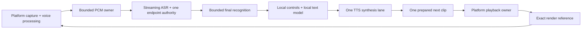

# Local voice performance review

Valid until: the next owner desktop/phone live A/B or a model/runtime replacement — then treat as history.

Reviewed: 2026-10-04. Architecture decision: [ADR-0214](adr/0214-local-voice-performance-architecture.md).
Current implementation and acceptance limits: [STATUS](../STATUS.md).

The reported symptoms were self-interruption, missed speech, slow replies and stuck turns.
The review found concrete scheduling and buffering defects, plus a substantial gap between
headless lifecycle correctness and demonstrated acoustic quality. A successful unit suite is
not evidence of accurate recognition, effective phone echo cancellation or acceptable thermals.

## Reproduced defects and repairs

| Failure | Evidence and repair | What verification establishes |
|---|---|---|
| Desktop can cut its own first speech after slow synthesis | The echo grace used synthesis admission rather than actual output. [ADR-0210](adr/0210-bind-barge-grace-to-audible-playback.md) binds it to the first rendered samples of the same reply, retaining pre-audio controls. | Synthetic playback/capture races, grace expiry and later real interruption; no physical echo verdict. |
| Phone has a synthesis-sized pause between every sentence | The mobile owner awaited synth → playback → cleanup before starting the next synthesis. [ADR-0211](adr/0211-prefetch-one-mobile-tts-clip.md) overlaps one next synthesis with current playback and cleans up exact generated files. | One active synthesis, one lookahead clip, generation cancellation and cleanup; no measured audible latency. |
| Brief phone decode stalls stop listening | Four unacknowledged capture messages were fatal even when they contained very little audio. [ADR-0212](adr/0212-coalesce-bounded-mobile-asr-capture.md) retains a bounded pending batch, preserving original endpoint observation boundaries. | Lossless accepted PCM, bounded buffering, exact ACKs and cancellation; no change to ASR model quality or steady-state throughput. |
| Desktop media stays cold behind several model generations | Runtime warm-up reached the engine only after LLM, addressing and cleaner steps. [ADR-0213](adr/0213-warm-media-before-language-models.md) gives the existing media warm step first place in the same worker. | Scheduling and failure isolation; no new inference concurrency or cold-model latency measurement. |

## Architecture assessment

[ADR-0214](adr/0214-local-voice-performance-architecture.md) records the incremental architecture
and the condition for a shared native media kernel. The costly desktop inference already runs
in Sherpa/ONNX and Ollama/llama.cpp; the Flutter app also calls native Sherpa and Gemma runtimes.
Changing the orchestration language alone does not change the selected model, remove echo,
reduce KV-cache memory or make an unsupported language recognizable.

The next media boundary is one platform owner for capture, playback and the exact render
reference. Real-time callbacks move timestamped PCM through bounded buffers; DSP/inference,
filesystem access and model preparation stay outside them. The control plane retains the
existing typed AgentEvent/Mode contract, explicit authority and generation cancellation.
A small C ABI to a Rust/C++ media implementation can be evaluated after copy/scheduling profiles
show where it helps. The current fixes do not introduce that new kernel.

This is a target boundary diagram; Flutter still uses generated WAVs/player clips, and desktop
still has inherited callback allocations/short copy locks. The implemented one-clip lookahead
is phrase pipelining, not streaming synthesis within a phrase.

## What established on-device systems optimize

Google's [on-device speech recognizer](https://www.research.google/blog/an-all-neural-on-device-speech-recognizer/)
uses compact streaming transducers and quantization. Apple's
[foundation-model report](https://machinelearning.apple.com/research/apple-foundation-models-2025-updates)
uses distillation and low-bit weights/cache, while its
[Core ML example](https://machinelearning.apple.com/research/core-ml-on-device-llama)
keeps KV state on device and reduces memory copies. These support compact native models,
bounded context and attention to memory movement rather than a wholesale language rewrite.

[LiteRT-LM](https://developers.google.com/edge/litert-lm/overview) supplies mobile acceleration
and constrained tool decoding. [MLC Android](https://llm.mlc.ai/docs/deploy/android.html)
exposes context and prefill budgets. [Home Assistant's local command path](https://www.home-assistant.io/blog/2025/02/13/voice-chapter-9-speech-to-phrase/)
illustrates handling known commands cheaply; its constrained recognizer is not a benchmark for
open-ended conversation. Runtime/model selection needs measurements on the actual device.

Android [voice communications](https://developer.android.com/reference/android/media/MediaRecorder.AudioSource#VOICE_COMMUNICATION)
uses AEC/AGC if available; [AEC](https://developer.android.com/reference/android/media/audiofx/AcousticEchoCanceler)
capability, activation and session ownership need checking. Apple's
[voice-processing API](https://developer.apple.com/documentation/avfaudio/avaudioionode/setvoiceprocessingenabled(_:))
provides the corresponding platform seam. Requested recorder flags do not prove the effective
route cancels the assistant's own voice. A future Oboe/AAudio adapter must preserve the voice
route rather than copy a game's audio configuration.

## Models and language coverage

The mobile application currently executes English streaming Zipformer. Its Whisper base.en
configuration helper is unused; ADR-0208 is an offline evidence comparator, not a shipped
second pass. Phone TTS is English Piper amy-low. No Romanian app path has been qualified.
The desktop SenseVoice profile's supported-language set also does not establish Romanian.

| Candidate | Supported facts from primary sources | Scope of a future comparison |
|---|---|---|
| [Sherpa-ONNX](https://github.com/k2-fsa/sherpa-onnx) | Existing native engine, cross-platform C/C++/Python/Dart/Rust bindings; model licenses are separate from Apache-2.0 code. | Keep the existing endpoint/control authority while measuring candidate models. |
| [Multilingual Whisper](https://github.com/openai/whisper/blob/main/whisper/tokenizer.py) via [whisper.cpp](https://github.com/ggml-org/whisper.cpp) | Romanian language support; native NEON/Metal/Core ML encoder and quantization. README reference RAM: base about 388 MB, small about 852 MB, before app/model concurrency. | Quantized multilingual base/small on actual phone; an .en checkpoint cannot supply Romanian. RAM numbers are not phone guarantees. |
| [Moonshine streaming](https://moonshine-voice.readthedocs.io/en/latest/models/available-models/) | Current Tiny/Small/Medium streaming: 34M/123M/245M, MIT; listed languages exclude Romanian. | English candidate only. Earlier repository rejection remains history for its exact model. Current versions need the same acceptance gates. |
| [Parakeet TDT v3](https://huggingface.co/nvidia/parakeet-tdt-0.6b-v3) | 600M, Romanian plus 24 other European languages, CC-BY-4.0. Official streaming example has 2-second chunks/right context. | Desktop quality candidate; no demonstrated low-resource phone or snappy endpoint result here. |
| [Qwen3-ASR 0.6B](https://huggingface.co/Qwen/Qwen3-ASR-0.6B) | Apache-2.0, Romanian among 30 languages, streaming/offline support; official kit emphasizes Transformers/vLLM/CUDA. | Desktop/candidate export evaluation. Published throughput does not establish phone CPU latency. |
| [Kokoro](https://huggingface.co/hexgrad/Kokoro-82M) | 82M, Apache-2.0 weights; listed languages exclude Romanian. [Voice guidance](https://huggingface.co/hexgrad/Kokoro-82M/blob/main/VOICES.md) warns about very short utterances. | English desktop voice; preserve useful phrase length when chasing first audio. |
| [Piper Romanian mihai](https://huggingface.co/rhasspy/piper-voices/blob/main/ro/ro_RO/mihai/medium/MODEL_CARD) | One speaker, 22.05 kHz; voice card cites CC0 dataset. The [maintained Piper engine](https://github.com/OHF-Voice/piper1-gpl) has GPL-3.0 terms. | Separate Romanian TTS candidate through the existing engine; record voice, engine and phonemizer licenses independently. |

These are research candidates, not adopted defaults. English/Romanian planning follows the
repository's existing language work; the owner has not supplied a new language-priority list.

## Required performance and acoustic evidence

Measure whole turns with exact model identities on each target phone and desktop route:

- After provisioning local model assets, disable inference networking and verify ASR, LLM and
  TTS together. Confirm no cloud or trusted-LAN fallback occurs when a local asset/decoder fails;
  missing local resources need a clear unavailable result. Provisioning downloads are a separate
  setup step. This fully offline acceptance check has not run on a physical device here.

- Speech end → endpoint → final text → first token → useful phrase → first PCM → actual playback.
  Report cold/warm p50/p95, synthesis gaps and output underflows separately from inference RTF.
- Disjoint English/Romanian/code-switch recordings, close/far microphones, noise, own-TTS and
  multi-voice strata. Score WER/CER and intent/slot success, especially names, STOP, negation and
  numbers. A better aggregate WER must not hide command hallucinations.
- Thirty-minute mixed capture/ASR/LLM/TTS sessions: CPU, whole-process RSS/PSS, accelerator
  memory, thermal status, battery drain, dropped frames and latency drift. Size context/KV,
  model threads and prefill to that measured budget; keep cancellation ahead of new inference.
- Owner bare-speaker A/B using the sole physical entry ./live.sh, including deliberate talk-over,
  exact STOP, slow synthesis, long replies and recovery. Preserve private bundles and route
  restoration. Phone voice processing needs a separate device test.

Initial targets to test, not achieved promises: p95 STOP-to-silence ≤150 ms; warm useful-phrase
TTS first PCM ≤250 ms; sustained streaming ASR RTF ≤0.5; simple warm speech-end-to-response
≤1.5 seconds p95. Revise targets from the device's actual steady thermal behavior.

## Remaining defects and limits

Mobile generic barge-in still accepts two-character partials and energy-only evidence without
an exact render-reference check. AEC-route effectiveness is unproved; this is a live reliability
gap even after prefetch/backpressure repairs. The standalone mobile demo Listen/Speak screens
still perform native work on the UI isolate. TTS preparation loads unrelated bundled assets.

Desktop non-4090 profiles inherit whole-clip TTS leveling; normal warm-up does not exercise the
final SenseVoice recognizer; idle online ASR still decodes blocks; per-model thread counts lack
a demonstrated total concurrent CPU budget. These need their own bounded replay/resource
comparisons before changing recognition or playback defaults.

Existing readiness can still reject the 4090 route until enrollment matches the active capture
front end (ADR-0209). None of this review certifies repaired live echo, recognition WER, phone
thermal behavior or a multilingual production default. Raw audio stays device-local; cloud
inference and trusted-LAN transport remain separate opt-in boundaries.

The 2026-10-04 read-only doctor check in this execution environment returned BASE NOT READY:
the selected Faster-Whisper CUDA verifier has no visible CUDA device, input/output device queries
fail and pactl cannot inspect the echo route. No route was changed and no microphone session
ran. Recheck the intended physical host before treating these environment limits as product
regressions; the selected final-STT profile remains fail-closed.

## Regression verification conditions

Mobile owner tests ran with Flutter 3.44.2 and Dart 3.12.2; the combined mobile suite passed
252 tests. This is Dart/widget/adapter verification, not execution of phone audio hardware.
Desktop's first broad run returned 89 failures, 11,179 passes and 42 skips: two baseline eager
import lists were stale, one test used public Git permissions as private-input evidence, and
private synthetic fixture tests rejected the environment's Git markers. [ADR-0215](adr/0215-reconcile-evaluator-import-closure-gates.md)
records the narrow gate repairs and paired original-source reproductions. Privacy guards,
source/model locks and old reports were preserved. Full-suite success must come from the
corrected test environment, not from treating that failed run as a pass.

The corrected combined Python gate passed **11,268**, skipped **42**, and emitted **9** inherited
dependency warnings in **429.71 seconds**. It used CI's two LiveKit exclusions and private
framework fixtures outside Git markers. Full Flutter analysis reported **No issues found**.
The exact commands and prior failed-run/baseline comparisons are in [WORKLOG](../WORKLOG.md).
These results verify the repaired control/media logic; none measures microphone recognition,
physical echo, phone thermal behavior or actual audible latency.
