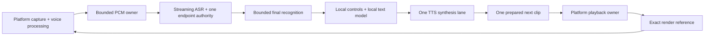

# Local voice performance review

Valid until: the next owner desktop/phone live A/B or a model/runtime replacement — then treat as history.

Reviewed: 2026-10-04. Architecture decision: [ADR-0214](adr/0214-local-voice-performance-architecture.md).
Current implementation and acceptance limits: [STATUS](../STATUS.md).

The reported symptoms were self-interruption, missed speech, slow replies and stuck turns.
The review found concrete scheduling and buffering defects, plus a substantial gap between
headless lifecycle correctness and demonstrated acoustic quality. A successful unit suite is
not evidence of accurate recognition, effective phone echo cancellation or acceptable thermals.

## Reproduced defects and repairs

| Failure | Evidence and repair | What verification establishes |
|---|---|---|
| Desktop can cut its own first speech after slow synthesis | The echo grace used synthesis admission rather than actual output. [ADR-0210](adr/0210-bind-barge-grace-to-audible-playback.md) binds it to the first rendered samples of the same reply, retaining pre-audio controls. | Synthetic playback/capture races, grace expiry and later real interruption; no physical echo verdict. |
| Phone has a synthesis-sized pause between every sentence | The mobile owner awaited synth → playback → cleanup before starting the next synthesis. [ADR-0211](adr/0211-prefetch-one-mobile-tts-clip.md) overlaps one next synthesis with current playback and cleans up exact generated files. | One active synthesis, one lookahead clip, generation cancellation and cleanup; no measured audible latency. |
| Brief phone decode stalls stop listening | Four unacknowledged capture messages were fatal even when they contained very little audio. [ADR-0212](adr/0212-coalesce-bounded-mobile-asr-capture.md) retains a bounded pending batch, preserving original endpoint observation boundaries. | Lossless accepted PCM, bounded buffering, exact ACKs and cancellation; no change to ASR model quality or steady-state throughput. |
| Desktop media stays cold behind several model generations | Runtime warm-up reached the engine only after LLM, addressing and cleaner steps. [ADR-0213](adr/0213-warm-media-before-language-models.md) gives the existing media warm step first place in the same worker. | Scheduling and failure isolation; no new inference concurrency or cold-model latency measurement. |

## Architecture assessment

[ADR-0214](adr/0214-local-voice-performance-architecture.md) records the incremental architecture
and the condition for a shared native media kernel. The costly desktop inference already runs
in Sherpa/ONNX and Ollama/llama.cpp; the Flutter app also calls native Sherpa and Gemma runtimes.
Changing the orchestration language alone does not change the selected model, remove echo,
reduce KV-cache memory or make an unsupported language recognizable.

The next media boundary is one platform owner for capture, playback and the exact render
reference. Real-time callbacks move timestamped PCM through bounded buffers; DSP/inference,
filesystem access and model preparation stay outside them. The control plane retains the
existing typed AgentEvent/Mode contract, explicit authority and generation cancellation.
A small C ABI to a Rust/C++ media implementation can be evaluated after copy/scheduling profiles
show where it helps. The current fixes do not introduce that new kernel.



This is a target boundary diagram; Flutter still uses generated WAVs/player clips, and desktop
still has inherited callback allocations/short copy locks. The implemented one-clip lookahead
is phrase pipelining, not streaming synthesis within a phrase.

## What established on-device systems optimize

Google's [on-device speech recognizer](https://www.research.google/blog/an-all-neural-on-device-speech-recognizer/)
uses compact streaming transducers and quantization. Apple's
[foundation-model report](https://machinelearning.apple.com/research/apple-foundation-models-2025-updates)
uses distillation and low-bit weights/cache, while its
[Core ML example](https://machinelearning.apple.com/research/core-ml-on-device-llama)
keeps KV state on device and reduces memory copies. These support compact native models,
bounded context and attention to memory movement rather than a wholesale language rewrite.

[LiteRT-LM](https://developers.google.com/edge/litert-lm/overview) supplies mobile acceleration
and constrained tool decoding. [MLC Android](https://llm.mlc.ai/docs/deploy/android.html)
exposes context and prefill budgets. [Home Assistant's local command path](https://www.home-assistant.io/blog/2025/02/13/voice-chapter-9-speech-to-phrase/)
illustrates handling known commands cheaply; its constrained recognizer is not a benchmark for
open-ended conversation. Runtime/model selection needs measurements on the actual device.

Android [voice communications](https://developer.android.com/reference/android/media/MediaRecorder.AudioSource#VOICE_COMMUNICATION)
uses AEC/AGC if available; [AEC](https://developer.android.com/reference/android/media/audiofx/AcousticEchoCanceler)
capability, activation and session ownership need checking. Apple's
[voice-processing API](https://developer.apple.com/documentation/avfaudio/avaudioionode/setvoiceprocessingenabled(_:))
provides the corresponding platform seam. Requested recorder flags do not prove the effective
route cancels the assistant's own voice. A future Oboe/AAudio adapter must preserve the voice
route rather than copy a game's audio configuration.

## Models and language coverage

The mobile application currently executes English streaming Zipformer. Its Whisper base.en
configuration helper is unused; ADR-0208 is an offline evidence comparator, not a shipped
second pass. Phone TTS is English Piper amy-low. No Romanian app path has been qualified.
The desktop SenseVoice profile's supported-language set also does not establish Romanian.

| Candidate | Supported facts from primary sources | Scope of a future comparison |
|---|---|---|
| [Sherpa-ONNX](https://github.com/k2-fsa/sherpa-onnx) | Existing native engine, cross-platform C/C++/Python/Dart/Rust bindings; model licenses are separate from Apache-2.0 code. | Keep the existing endpoint/control authority while measuring candidate models. |
| [Multilingual Whisper](https://github.com/openai/whisper/blob/main/whisper/tokenizer.py) via [whisper.cpp](https://github.com/ggml-org/whisper.cpp) | Romanian language support; native NEON/Metal/Core ML encoder and quantization. README reference RAM: base about 388 MB, small about 852 MB, before app/model concurrency. | Quantized multilingual base/small on actual phone; an .en checkpoint cannot supply Romanian. RAM numbers are not phone guarantees. |
| [Moonshine streaming](https://moonshine-voice.readthedocs.io/en/latest/models/available-models/) | Current Tiny/Small/Medium streaming: 34M/123M/245M, MIT; listed languages exclude Romanian. | English candidate only. Earlier repository rejection remains history for its exact model. Current versions need the same acceptance gates. |
| [Parakeet TDT v3](https://huggingface.co/nvidia/parakeet-tdt-0.6b-v3) | 600M, Romanian plus 24 other European languages, CC-BY-4.0. Official streaming example has 2-second chunks/right context. | Desktop quality candidate; no demonstrated low-resource phone or snappy endpoint result here. |
| [Qwen3-ASR 0.6B](https://huggingface.co/Qwen/Qwen3-ASR-0.6B) | Apache-2.0, Romanian among 30 languages, streaming/offline support; official kit emphasizes Transformers/vLLM/CUDA. | Desktop/candidate export evaluation. Published throughput does not establish phone CPU latency. |
| [Kokoro](https://huggingface.co/hexgrad/Kokoro-82M) | 82M, Apache-2.0 weights; listed languages exclude Romanian. [Voice guidance](https://huggingface.co/hexgrad/Kokoro-82M/blob/main/VOICES.md) warns about very short utterances. | English desktop voice; preserve useful phrase length when chasing first audio. |
| [Piper Romanian mihai](https://huggingface.co/rhasspy/piper-voices/blob/main/ro/ro_RO/mihai/medium/MODEL_CARD) | One speaker, 22.05 kHz; voice card cites CC0 dataset. The [maintained Piper engine](https://github.com/OHF-Voice/piper1-gpl) has GPL-3.0 terms. | Separate Romanian TTS candidate through the existing engine; record voice, engine and phonemizer licenses independently. |

These are research candidates, not adopted defaults. English/Romanian planning follows the
repository's existing language work; the owner has not supplied a new language-priority list.

## Required performance and acoustic evidence

Measure whole turns with exact model identities on each target phone and desktop route:

- After provisioning local model assets, disable inference networking and verify ASR, LLM and
  TTS together. Confirm no cloud or trusted-LAN fallback occurs when a local asset/decoder fails;
  missing local resources need a clear unavailable result. Provisioning downloads are a separate
  setup step. This fully offline acceptance check has not run on a physical device here.

- Speech end → endpoint → final text → first token → useful phrase → first PCM → actual playback.
  Report cold/warm p50/p95, synthesis gaps and output underflows separately from inference RTF.
- Disjoint English/Romanian/code-switch recordings, close/far microphones, noise, own-TTS and
  multi-voice strata. Score WER/CER and intent/slot success, especially names, STOP, negation and
  numbers. A better aggregate WER must not hide command hallucinations.
- Thirty-minute mixed capture/ASR/LLM/TTS sessions: CPU, whole-process RSS/PSS, accelerator
  memory, thermal status, battery drain, dropped frames and latency drift. Size context/KV,
  model threads and prefill to that measured budget; keep cancellation ahead of new inference.
- Owner bare-speaker A/B using the sole physical entry ./live.sh, including deliberate talk-over,
  exact STOP, slow synthesis, long replies and recovery. Preserve private bundles and route
  restoration. Phone voice processing needs a separate device test.

Initial targets to test, not achieved promises: p95 STOP-to-silence ≤150 ms; warm useful-phrase
TTS first PCM ≤250 ms; sustained streaming ASR RTF ≤0.5; simple warm speech-end-to-response
≤1.5 seconds p95. Revise targets from the device's actual steady thermal behavior.

## Remaining defects and limits

Mobile generic barge-in still accepts two-character partials and energy-only evidence without
an exact render-reference check. AEC-route effectiveness is unproved; this is a live reliability
gap even after prefetch/backpressure repairs. The standalone mobile demo Listen/Speak screens
still perform native work on the UI isolate. TTS preparation loads unrelated bundled assets.

Desktop non-4090 profiles inherit whole-clip TTS leveling; normal warm-up does not exercise the
final SenseVoice recognizer; idle online ASR still decodes blocks; per-model thread counts lack
a demonstrated total concurrent CPU budget. These need their own bounded replay/resource
comparisons before changing recognition or playback defaults.

Existing readiness can still reject the 4090 route until enrollment matches the active capture
front end (ADR-0209). None of this review certifies repaired live echo, recognition WER, phone
thermal behavior or a multilingual production default. Raw audio stays device-local; cloud
inference and trusted-LAN transport remain separate opt-in boundaries.

The 2026-10-04 read-only doctor check in this execution environment returned BASE NOT READY:
the selected Faster-Whisper CUDA verifier has no visible CUDA device, input/output device queries
fail and pactl cannot inspect the echo route. No route was changed and no microphone session
ran. Recheck the intended physical host before treating these environment limits as product
regressions; the selected final-STT profile remains fail-closed.

## Regression verification conditions

Mobile owner tests ran with Flutter 3.44.2 and Dart 3.12.2; the combined mobile suite passed
252 tests. This is Dart/widget/adapter verification, not execution of phone audio hardware.
Desktop's first broad run returned 89 failures, 11,179 passes and 42 skips: two baseline eager
import lists were stale, one test used public Git permissions as private-input evidence, and
private synthetic fixture tests rejected the environment's Git markers. [ADR-0215](adr/0215-reconcile-evaluator-import-closure-gates.md)
records the narrow gate repairs and paired original-source reproductions. Privacy guards,
source/model locks and old reports were preserved. Full-suite success must come from the
corrected test environment, not from treating that failed run as a pass.


The corrected combined Python gate passed **11,268**, skipped **42**, and emitted **9** inherited
dependency warnings in **429.71 seconds**. It used CI's two LiveKit exclusions and private
framework fixtures outside Git markers. Full Flutter analysis reported **No issues found**.
The exact commands and prior failed-run/baseline comparisons are in [WORKLOG](../WORKLOG.md).
These results verify the repaired control/media logic; none measures microphone recognition,
physical echo, phone thermal behavior or actual audible latency.


## Restart and research follow-up (2026-10-05)

Completed read-only upstream research found reusable released components, but no inspected
project established all of general conversation, reliable tools, accurate English recognition,
small phone footprint and sustained open-speaker operation. No researched model or runtime
was installed or promoted. These are follow-up candidates under ADR-0214, not new defaults.

| Reference | Reusable area | Evidence boundary / next comparison |
|---|---|---|
| [Soniqo Android](https://github.com/soniqo/speech-android), [shared C++ core](https://github.com/soniqo/speech-core), [Apple SDK](https://github.com/soniqo/speech-swift) | Thin platform shells, shared native inference, model lifecycle and device benchmark harnesses. Android 0.0.22 released 2026-09-15. | Maintainer reports Galaxy S23 Ultra command-end to first synthesized sample 908 ms / whole-app 1,116 MB PSS in the [July device report](https://github.com/microsoft/onnxruntime/discussions/29780). Narrow command demo, not general-chat or physical-audibility proof; does not override this repo's Parakeet quality gates. |
| [LocalVQE](https://github.com/localai-org/LocalVQE) | C API, streaming echo-only model, exact playback reference. | Published 203K model: about 3 MB weights, 1.29 ms median / 1.89 ms p99 per 16 ms hop on one Ryzen 9 7900 thread; separate 49K line about 21x realtime on one Pi 5 core. Compare near-end speech/ASR preservation, double-talk and self-triggering on our route before adoption; inference timing is not acoustic validation. |
| [Skadoosh 0.12.1](https://docs.rs/skadoosh/0.12.1/skadoosh/), [Pipecat playback](https://github.com/pipecat-ai/pipecat/blob/v1.12.0/src/pipecat/transports/base_output.py), [LiveKit generation](https://github.com/livekit/agents/blob/livekit-agents%401.8.4/livekit-agents/livekit/agents/voice/generation.py) | Bounded audio queues, turn cancellation, stale-clip rejection, playback flush and heard-history accounting. | Inspect exact implementations and preserve finite deadlines. Callback-flush timings do not establish speech-to-silence latency. LiveKit adaptive interruption uses Cloud inference and cannot be the fully local policy. |
| [Domia worker pool](https://github.com/domia-ai/domia-core/blob/main/src/modules/inference-pool/controller/index.ts) / [voice admission](https://github.com/domia-ai/domia-core/blob/main/src/modules/voice-admission/controller/index.ts) | Bounded workers, warm/lazy loading, idle reap, queue depth and timeout. | Early local-agent reference; compare against implemented ADR-0219 residency before adding machinery. No independently reproduced whole-agent performance result here. |
| [DAWN](https://github.com/The-OASIS-Project/dawn) / [Home Assistant Voice PE](https://www.home-assistant.io/voice-pe/) | Embedded native boundaries and shipped acoustic hardware. | Satellite designs can send audio to a host. Device-only defaults and explicit trusted-LAN grant remain governed by ADR-0097; their host/satellite measurements are not phone-contained results. |
| [Context Spanning](https://github.com/mindlogic-ai/Context-Spanning), [PersonaPlex](https://github.com/NVIDIA/personaplex), [MiniCPM-o 4.5](https://huggingface.co/openbmb/MiniCPM-o-4_5) | Separate conversational timing from asynchronous reasoning/tool execution. | GPU research/desktop experiment references only: [Context Spanning](https://arxiv.org/html/2609.33443v1) evaluated on two RTX Pro 6000 GPUs and reported 47% tool-scenario pass rate; MiniCPM-o native full-duplex deployment requires 12 GB NVIDIA VRAM or M4 Max / 24 GB RAM. No phone promotion. |

Prioritized pending work:

1. Refresh enrollment on the active desktop echo-cancel capture route before Responsive/Compact
   physical A/B (ADR-0209). The last actual-host startup reached READY, then stopped at the
   enrollment/capture-domain guard; no assessed live turns followed. A temporary non-enrolled
   trial still needs the owner's explicit choice and preserves identity-sensitive restrictions.
2. Profile exact capture/render-reference timing and evaluate a bounded LocalVQE echo-only
   candidate with disjoint near-end, own-TTS, STOP and multi-voice cases. Preserve calibrated
   delay, existing authority and raw-audio privacy gates; do not stack unmeasured denoisers.
3. Measure whole-turn playback and cancellation before selecting a small native media module.
   Borrow Soniqo/Skadoosh lifecycle patterns only where profiles justify changes. Rust/C++ is a
   component option under ADR-0214, not a whole-control-plane rewrite.
4. Qualify English ASR/TTS on the actual phone, then run 30-minute offline mixed sessions with
   whole-process memory, thermal drift, useful first audio and interruption-to-silence timing.
   Retain all holdout/command-quality gates. Repository weights, voice assets, engine and
   phonemizer licences require separate review before redistribution.

Windows resume steps:

- Use the human-run fleet `ops start` on Windows, then inspect speaker `main`, `origin/main`
  and `git status --porcelain`; do not assume the Linux chat or its native session ID migrated.
  Read STATUS, this follow-up and [performance modes](performance_modes.md) before coding.
- The completed performance publication is 5800a94; Linux main at this review also contains
  concurrent dormant Go-serving documentation through 2367292. Verify the latest remote head
  rather than resetting to either historical commit. This follow-up has no unfinished source.
- Prepare a Windows-native environment with `.\install.ps1 -SkipModels` from PowerShell if
  needed. This deps-only path deliberately exits 2 / INCOMPLETE before doctor; it is not READY.
  Do not reuse Linux `.venv` or absolute model/config paths. Existing model assets and
  private recordings are machine-local and are not retrieved by git; inventory destination
  assets and obtain them only through the existing model setup/licence gates.
- Start with `.\.venv\Scripts\python.exe -m core --session console --llm echo`. Run
  `.\.venv\Scripts\python.exe -m tools.doctor` only after microphone checks are explicitly authorized; deferred Ollama readiness is not a
  full live verdict. Windows capture must follow ADR-0081/0082 voice-communications checks;
  Linux `live.sh`/PulseAudio receipts cannot qualify a different device or capture domain.
- Before a later physical test, prepare the local LLM/audio route and compatible enrollment;
  keep private bundles off git. Current Linux/Dart receipts remain historical verification,
  not Windows or physical-phone passes. No model download or live test runs in this wrap-up.
### Windows preparation result and Linux continuation (2026-10-05)

Valid until: the destination environment, assets or owner microphone preference changes — then treat as history.

Windows-native CPython 3.10.11 ran `python -B -m core --session console --llm echo --device desktop --performance current`
from the task worktree: exit 0 in 1.890 s with the expected synthetic echo response. The child skipped the private config overlay,
removed `DATABASE_URL` only from its environment and isolated new logs with pruning disabled. `python -I -B -m pip check`
returned exit 0 / no broken installed requirements. These results qualify console logic and installed dependency declarations only.

Paul explicitly kept microphone checks deferred. The selected Windows doctor initializes a communications capture endpoint to inspect
OS effects, even with `--defer-ollama`/`--defer-llm`; it was not run. No Windows READY, capture-domain match or fresh AEC/live result is claimed.
The existing Sherpa wheel is 1.13.2 versus the 1.13.3 pin; sentencepiece/python-dotenv are absent, the bound INT8 encoder and Compact
Kitten assets are missing, and enrollment preparation/persistence/promotion uses unavailable Windows `fchmod`/`getuid`/`fcntl` APIs.
A future Windows adapter needs equivalent private ownership/ACL, handle revalidation, atomic durability and locking gates, without bypasses.

For Linux/Claude continuation, read current STATUS and recheck that host's actual venv, assets, LLM and echo route; git carries no private
recordings, enrollment or native runtime receipts. The Linux retained enrollment incompatibility and physical STOP/talk-over gates remain
open. Refresh isolated enrollment on the active capture front end before authorized Current/Responsive/Compact A/B (ADR-0209/0056/0066).
Exact playback/cancellation, bounded echo-only LocalVQE comparisons and disjoint phone ASR/memory/thermal evidence remain pending.
No model download/promotion, installation, enrollment bypass, microphone/private-audio opening or physical A/B occurred in Windows preparation;
no tests or runtime checks were rerun for this documentation freeze. Owner deferral remains in force for later continuation.

### Linux headless preparation and physical checklist (2026-10-05)

Valid until: the host environment, model assets, route or owner deferral changes — then treat as history.

At source `dfa53b29fc2f2f45179a907902ced1462e2a8c7b`, the actual Linux CPython 3.12.3 venv passed
666 focused synthetic tests in 6.87 s, with two inherited Sherpa SWIG warnings and the inherited exit warning.
Coverage includes frontend/enrollment compatibility and fail-closed word-cut startup, private preparation/promotion
races and durability, rendered-onset generation ownership, playback receipts/cancellation, launcher route cleanup,
model/mode contracts and APM/double-talk. These tests use generated fixtures and injected services/devices.
They do not inspect retained enrollment, accept biometric state or qualify acoustic behavior. Exact command: [WORKLOG](../WORKLOG.md).

The actual venv ran the synthetic `--session console --llm echo --device desktop --performance current` path:
exit 0, expected reply and control completion, 0.290 s wall. The child skipped the private config overlay,
removed `DATABASE_URL` from its own environment and wrote fresh task-local logs with pruning disabled.
The first wrapper incorrectly expected an `Echo:` prefix; its child had already exited 0 with the correct
`You said:` reply. The corrected assertion passed on rerun. This is console/control evidence only.

Read-only model/route inspection used the actual host settings resolved for `desktop_gpu_4090`:

| Check | Observed result | Limit / outstanding prerequisite |
|---|---|---|
| Installed packages | Sherpa 1.13.3, Faster-Whisper 1.2.1, CTranslate2 4.8.1, pinned CUDA wheels, sentencepiece 0.2.1 and httpx 0.28.1 present; `pip check` exit 0 | python-dotenv is absent. Installed-dependency consistency does not prove complete requirements installation; no packages were installed. |
| Selected media assets | Current selected paths/metadata pass; Responsive and Compact exact bound asset hashes and selected paths/metadata pass | Current has no candidate-hash contract. Native ASR/TTS construction, selected Parakeet/Faster-Whisper CUDA FP16 warming and full readiness were not exercised. |
| Local LLM cache | A temporary loopback-only daemon on port 11435 with the launcher's `OLLAMA_GO_TEMPLATE=1` passes Gemma3 presence and pinned MiniCPM Q8 identity | An otherwise identical daemon without that setting rejects MiniCPM identity. No alias repair, generation, pull or warm-up ran; each owned daemon was stopped. A reused daemon must also satisfy readiness. |
| Echo route | Actual-host `pactl` inspection succeeds; no echo-cancel module is loaded and the selected route is unbound | The earlier sandbox could not inspect it. No route/default was changed. Authorized physical setup must establish the exact capture/render front end before enrollment. |
| Retained enrollment | Historical incompatibility remains open under ADR-0209 | No enrollment file, embedding, private recording or private receipt was opened. File-presence readiness cannot prove frontend compatibility. |

The normal Ollama endpoint was not running at inspection. Session-scoped services and route provisioning
belong to the authorized launcher; these observations do not establish a new product defect.
No full/deferred doctor, microphone, physical playback, inference, download, enrollment transaction or default change ran.

At this headless checkpoint the following checklist was **blocked by Paul's microphone/doctor deferral**.
The later Linux authorization and isolated candidate below supersede that deferral on this host only. Enrollment preparation and promotion require explicit
permission to read/mutate the named private enrollment/config files, despite being device-free.

1. Obtain the owner's explicit change to the deferral and permission for private enrollment preparation,
   recording and eventual live review. Use a fresh speaker task branch/worktree; preserve all historical files.
   Confirm the intended physical Linux host and the `desktop_gpu_4090` profile. Recheck venv/model inventory,
   the selected CUDA FP16 runtime and local LLM readiness when doctor is authorized; any failure blocks capture.
2. Establish and verify the intended canonical echo-cancel capture/playback route, exact masters and frontend,
   and calibrate reference delay through the existing echo-probe/auto-delay procedure (ADR-0005/0013).
   Do not substitute 260 ms. Enrollment must use that exact frontend. `live.sh` owns ordinary session setup
   and restoration but rejects enrollment and has no setup-only flag; the enrollment route setup must be
   explicitly reviewed before the separate printed core enrollment command is run.
3. Prepare an isolated v5 candidate with a schema-v2 preparation marker using `tools.prepare_enrollment` (ADR-0056/0066).
   Its required inputs are `--worktree`, `--expected-config-target`, `--expected-enrollment`, `--backup`
   and a unique `--candidate-name enrollment.v5-<id>.json`. The feature local-config link must already target
   the explicitly named primary config. The historical enrollment and a new adjacent backup must remain
   independent and unchanged; unsafe owners, aliases, links, races, locks or durability failures block progress.
   Private absolute paths are deliberately unresolved here because those files remain unopened.
4. Run only the successful preparer's exact printed command from that worktree, on the verified route:
   `python -m core --session local --device desktop_gpu_4090 --performance responsive --enroll --require-prepared-enrollment --enroll-seconds 12 --enroll-passes 3`.
   Stop on frontend/model incompatibility. Do not weaken enrolled-speaker authority or choose an identity-off trial.
5. After candidate compatibility, run separate bare-speaker sessions from the candidate worktree:

   ```sh
   ./live.sh --device desktop_gpu_4090 --performance current
   ./live.sh --device desktop_gpu_4090 --performance responsive
   ./live.sh --device desktop_gpu_4090 --performance compact
   ```

   Keep route, geometry, final profile and the agreed script comparable. Check direct addressing, slow first
   synthesis without self-cut, long-reply gaps/static, exact STOP, later ordinary talk-over, own-TTS ambiguity,
   useful first audio and recovery. Preserve complete private bundles and verify restoration after each session.
   Use explicit selected log paths with `python -m tools.live_audio_ab /absolute/private/run-<id>.txt`;
   keep the owner's acoustic verdict separate from log/receipt accounting. Headless timestamps are not DAC latency.
6. Promote only after explicit owner acceptance of the complete live gate, using `tools.promote_enrollment`
   with its exact worktree/primary/candidate/source/backup/accepted-copy paths and `--accept-live-gate`.
   Exit 0 means active; 2 refused, 3 staged/inactive and 4 ambiguous require the documented handling (ADR-0066).
   Historical enrollment, backup, isolated candidate, recordings and native receipts stay local and intact.

At this historical preparation checkpoint LocalVQE had no comparison tool. The later
[ADR-0231](adr/0231-evaluate-localvqe-offline-with-paired-input-authority.md) now records bounded
synthetic and original AFTER-HOST paired comparisons; they do not justify acoustic/default adoption.
Phone ASR, offline whole-session behavior, memory, thermal and physical gates
likewise require separately authorized device work; Linux console/assets/metadata cannot qualify them.

### Owner live continuation and MiniCPM correction (2026-10-05)

Valid until: new host/model/route evidence or the owner's next choice — then treat as history.

Paul authorized Linux microphone/doctor checks, first chose a session-only identity-off trial, then explicitly
authorized isolated enrollment preparation and recording. The 4090 Responsive start passed full READY, including
selected final decode and CUDA FP16 verification, but refused the older enrollment after microphone calibration.
4090 identity-off correctly refused before host setup. The supported Desktop Responsive identity-off session ran;
it uses whole-clip leveling and a smaller context budget, so it is not equivalent to the 4090 streaming RMS path.
It then spoke internal instructions and was stopped. New private evidence was retained; route defaults were
restored and every launcher-owned daemon was stopped. No physical STOP or quality acceptance follows.

The existing guarded preparation transaction created an independent protected backup, isolated the task config,
and recorded a fresh v5 candidate from three clips on the current signal-AGC/GTCRN echo-cancel capture front end.
The historical reference and primary pointer are unchanged. Candidate compatibility, Current/Responsive/Compact
live acceptance and explicit promotion remain separate gates. Private paths, embeddings, voice and native receipts
remain machine-local; reuse that candidate worktree for validation and preserve it through any later promotion.

[ADR-0225](adr/0225-prefill-minicpm-ollama-no-thinking.md) corrects the desktop alias's missing no-thinking prefill.
The same official Q8 weights, alias, stop set, parameters, completion-only contract and Gemma main tier remain.
After reviewed source is available on the host, `python -m tools.setup_minicpm --no-pull` can rebuild the alias
from its already verified local source cache; use the launcher-owned Go-template daemon. No model download is
needed for this correction. Missing cached weights must stop this continuation rather than trigger installation.
The correction passed exact identity and the no-reasoning-markup property in public generate/stream probes.
Concise-prompt arithmetic was correct, but the shipped voice-persona prompt yielded the wrong answer, 4.2, in both
API paths. An ambient statement still classified incorrectly. These answer/addressing quality limits remain open;
the initial arithmetic substring assertion was too loose and is not a pass. Identity does not qualify open-room behavior.

The repaired 4090 Responsive retry accepted the fresh candidate on the actual capture front end, warmed the
speaker gate and started capture plus streaming RMS playback. Paul reported that only random room noises
preceded the unsolicited speech. A short recognized fragment passed the addressing model as ACT, and the
answer again copied internal instructions. Candidate compatibility is therefore verified, while ambient-noise
admission, addressing and reply quality remain red. The template correction is not an instruction-copy defense.
The trial was stopped with Ctrl-C; its private diagnostic bundle completed, original defaults were restored and
the owned daemon stopped. Follow-up host inspection found no playback streams or remaining voice-entry process.
Keep the candidate worktree, backup and private evidence; do not promote before full owner acceptance.

[ADR-0226](adr/0226-require-complete-addressing-decision.md) now rejects multiword addressing replies instead
of admitting their first ACT token. Valid labels/aliases, explicit request shortcuts and caller policy survive.
This closes a reproduced format bug; exact ACT misclassification of noise and reply instruction-copying remain.
Public shorter-prompt trials supplied no safe replacement. A separate streaming enum diagnostic improved format
for both local tiers, but MiniCPM still admitted all six negative cases while Gemma3 matched all twelve labels.
That small sample supports considering a stronger local trial, without changing defaults or qualifying behavior.

Paul subsequently chose **stop live testing for now**. No parser live retry or stronger-tier live trial occurred.
Keep microphone, doctor and live retries off until his explicit resume. Preserve the compatible candidate,
historical reference, protected backup and private evidence; no promotion or primary pointer change is authorized.


## Implementation plan (2026-10-09)

Owner scope: execute the researched improvements, with substantial refactoring allowed.
Runtime authority, local-only audio, exact cancellation, optional capabilities and seven modes
remain acceptance requirements. The preserved October 5 enrollment/evidence lane is not modified.

| Stage | Deliverable | Acceptance | Progress |
|---|---|---|---|
| 1. Admission | Typed conversation cues before ambient input can retire current work; bounded follow-up state; ordinary implicit questions remain available. | Wrong ACT on idle room fragments cannot invoke answering, tools or cancellation; STOP, requests, follow-up and mode/provenance regressions pass. | Complete headless: ambient-before-cancel admission, canonical commands, exact rejected-partial retirement, console preservation and rendered-resume follow-up. |
| 2. Decisions and answers | Independent bounded local decision requests; public-only model quality cases; evidence-backed spoken-answer corrections. | Semantic negatives and answer behavior scored separately from valid formatting; cancellation/egress preserved; latency and failures reported. | Complete evaluation: explicit Qwen/spoken profile and bounded decisions; GPU mixed cases pass; CPU latency/semantic gate remains open; compact prompt rejected (ADR-0235). |
| 3. Desktop media/portability | Profile Linux/Windows/macOS core playback and portable persistence; repair an independently reproduced bottleneck or defect. | Deterministic lifecycle/resource/platform checks; actual OS/audio claims only when run. | Implemented: no replay after TTS errors, isolated output failure and bounded explicit recovery. Native Windows/macOS and physical tests remain open. |
| 4. Echo reference | Correct absolute reference timeline and bounded-copy reads; measured allocations/latency; assess offline candidate comparison. | Deterministic wrap/delay/overflow/concurrent tests plus APM/DTD; no acoustic default or enrollment promotion without physical comparison. | Complete offline: ring repair plus five synthetic and five recorded comparison cells; no AEC default change. |
| 5. Integration | Review each stage, run combined desktop gates, preserve benchmark receipts and update current STATUS. | Qualified commits integrated without losing concurrent changes; physical and other-OS claims listed independently. | Complete software verification: 12192 passed, 41 skipped; scoped lint/docs clean; native evidence preserved. Physical and other-OS gates remain open. |

Owner priority clarified: Linux, Windows and macOS desktop core first; mobile frameworks are
out of the current implementation target. Android PCM work is preserved separately at
`codex/mobile-pcm-streaming` / `dfcef686aff2ce3b69eff41803acbfbb019cb425`, unmerged and
not fully qualified. It must not be included in the desktop landing. Android/iOS and a lighter
future shell remain later work; Flutter is the prior demo, not a required future architecture.

Current constraint: the installed VITS model finishes a sentence before its native callback;
mobile full-sentence RMS/declick requires that waveform. Removing WAV transport can reduce
copies/storage, but a different qualified streaming model is needed for earlier intra-sentence
samples. Installed local-model headless probes are permitted in this implementation; the prior
owner stop of microphone/doctor/live tests is not treated as lifted by a refactoring request.
A physical trial is a final owner gate once the implementation is reviewable. Phone and thermal
acceptance require the corresponding physical device and are never inferred from desktop tests.

### Desktop implementation findings (2026-10-10)

Valid until: changed source/model/platform or fresh physical evidence — then treat as history.

- Conversation admission now precedes input replacement. Idle fragments cannot
  interrupt useful work merely because a small model returns ACT. Current heard
  questions still permit short answers; controls and provenance retain their
  existing authority ([ADR-0227](adr/0227-bind-conversational-admission.md)).
- Addressing and routing decisions have independent token/output/deadline bounds
  with unavailable decisions kept distinct from semantic uncertainty. Large
  answer budgets remain available ([ADR-0228](adr/0228-bound-local-model-decisions.md)).
- Desktop synthesis cannot retry after entering a native generate call. Output
  failure terminalizes queued receipts and preserves capture/control processing;
  exact uncertain native cleanup remains quarantined. Explicit recovery never
  replays a failed fragment ([ADR-0233](adr/0233-never-retry-entered-desktop-tts-generation.md),
  [ADR-0234](adr/0234-isolate-desktop-output-failure-and-explicit-recovery.md)).
- The reference-ring repair removed temporary index arrays and fixed oversized
  writes. Synthetic paired-read means fell from 20.56–49.04 us to 6.20–8.32 us,
  depending on the case; these are microbenchmarks, not whole-turn latency
  ([ADR-0230](adr/0230-bound-played-reference-ring-copies.md)).
- Offline LocalVQE ran against synthetic signals and one original 141.6-second
  local AFTER-HOST mic/reference pair. Its 203K model used 0.343 seconds of processing wall time per second of
  recording, versus 0.016 for the installed APM echo-only comparator. The unlabeled recording cannot establish
  echo/near-speech/ASR quality; no AEC adoption follows ([ADR-0231](adr/0231-evaluate-localvqe-offline-with-paired-input-authority.md)).

The measured changes retain native Sherpa/ONNX/Ollama inference and use existing
NumPy native copies. They do not establish a Python-to-Rust rewrite benefit.
Windows secure enrollment persistence still needs a reviewed native file/ACL
implementation and a Windows runner; macOS audio behavior also requires actual
hardware. No cross-platform READY, physical latency or acoustic acceptance is
implied by Linux headless tests. Mobile work remains the separate deferred branch.

### Final combined verification (2026-10-10)

Valid until: implementation changes or a new platform/physical result — then treat as history.

The final desktop CI-style suite passed **12,192 tests**, with **41 skips** and
**nine inherited dependency warnings**, in 562.40 seconds. Physical audio was
disabled; the two LiveKit exclusions match CI. The unchanged stop/restart flow
and a new exact-key rejected-final regression are included. Scoped fatal-error
Ruff checks and repository documentation checks are clean. Native and audio
quality limits above remain independent of this logic gate.

The real console entrypoint also returned the expected echo using public typed
input and forced in-memory state. No phone code was merged. The protected prior
enrollment, backup and recordings remain unchanged. The owner’s October 5 stop
still governs any microphone, doctor or live retry.

## Second desktop pass: mature implementation lessons (2026-10-10)

Valid until: source changes, a newer reviewed upstream release or physical evidence — then treat as history.

The owner requested another implementation pass **before** a live trial. Desktop
Linux/Windows/macOS and English remain the scope; microphone and doctor runs stay
paused. Published releases and source ownership mechanisms are useful evidence,
but a working dictation app, remote satellite or cloud-backed example is not proof
of a complete local open-speaker conversational agent on this hardware.

| Reviewed implementation | What its working scope establishes | Applied here or explicit limit |
|---|---|---|
| [Home Assistant local voice](https://www.home-assistant.io/voice_control/voice_remote_local_assistant/) and [Speech-to-Phrase 1.4.3](https://github.com/OHF-Voice/speech-to-phrase/blob/78354721f5c8cc55ec8e80dc7ff372d49b044eaa/README.md) | Restricted command recognition can use far less compute; the host runs the pipeline. Its published Pi speed is restricted-grammar evidence. | Preserve open-ended English conversation. Do not replace general ASR with a home-control grammar. The [current upstream notice](https://github.com/OHF-Voice/speech-to-phrase#speech-to-phrase) moves development to OHF-Voice/apps with constrained CTC; that rewrite is not a locally measured comparison here. |
| [Linux Voice Assistant 1.1.15](https://github.com/OHF-Voice/linux-voice-assistant/blob/43a183a2322cde4c9e2558f333124941fdeaa439/linux_voice_assistant/satellite.py#L556) | A usable Linux satellite coordinates listening/playback and delegates the assistant pipeline; playback-time wake behavior and AEC hardware assumptions matter. | Retain the local pipeline and exact barge-in authority. Muting recognition for all TTS would remove a required capability. |
| [OpenVoiceOS Dinkum 0.11.0a2](https://github.com/OpenVoiceOS/ovos-dinkum-listener/blob/45a96175e988e5b8f0d71c020e43e2893bca8c28/ovos_dinkum_listener/voice_loop/voice_loop.py) | Explicit listening states, bounded pre-roll, timeouts and platform plugins; this cited release is a prerelease. Locality depends on selected plugins. | Keep explicit modes and bounded capture ownership. Continuous-listening examples do not establish echo immunity. |
| [RealtimeSTT 1.1.2](https://github.com/KoljaB/RealtimeSTT/blob/07df3600286ea7794cf87d905aab6fccbb09dfc0/RealtimeSTT_server/production_server.py#L2957) | Latest pending work is owned before worker start and stale preview results are fenced. | Our exact generation/receipt cancellation remains the authority. Their advisory request-to-publish release timings are not end-of-speech-to-audio latency. |
| [RealtimeTTS 0.8.10](https://github.com/KoljaB/RealtimeTTS/blob/50abd79cfb6033fe2781abc7c97291fe70dcc3ea/RealtimeTTS/text_to_stream.py#L520) | An early first fragment can overlap ongoing text generation with synthesis; later chunks can be longer. | Implemented bounded opt-in first-fragment delivery in ADR-0239, with expression/numeric guards, cancellation and no replay. Physical prosody remains unqualified. |
| [Pipecat 1.12.0 latency observer](https://github.com/pipecat-ai/pipecat/blob/1559a684b1ee9771b36454b72418d7364b518e7f/src/pipecat/observers/user_bot_latency_observer.py#L367) | Separate service/turn latency contributions make the bottleneck diagnosable. Its Piper example also uses hosted ASR/LLM. | Implemented scalar-only, captured-turn stages and exact playback receipt observations in ADR-0240. No unbounded upstream queue or cloud service is introduced. |
| [whisper.cpp 1.9.5](https://github.com/ggml-org/whisper.cpp/blob/d1be6fde11ac6e0407606b4e42fe72d34add8037/README.md) | Native quantization, platform acceleration, fixed audio history and cooperative abort are practical building blocks. | Implemented paired fixed calibration buffers using existing NumPy native copies (ADR-0238). This is a recognizer/runtime reference, not a complete agent or a reason to change ASR without quality evidence. |
| [Handy 0.9.8 model ownership](https://github.com/cjpais/Handy/blob/v0.9.8/src-tauri/src/managers/transcription.rs) | A desktop local dictation app uses explicit model ownership, cleanup and idle behavior. | Implemented foreground retirement of speculative warm-up (ADR-0237), preserving selected model residency and foreground limits. Rust alone does not establish a faster voice agent. |

### Plan and measured progress

| Step | Completion condition | Result |
|---|---|---|
| Review mature projects and reproduce a local cost | Cite exact source and distinguish product scope from latency claims. | Complete; current release/source review above, warm-lock reproducer and paired buffer baseline retained. |
| Let real input retire warm work | Cancellable warm stream, no successor helper after retirement, local-only built-in selection, no second invocation after entered error. | Complete headlessly; 207 focused tests. Foreign noncooperative native work is not preempted. |
| Reduce recurring calibration allocation | Byte-identical chronological inputs and unchanged estimator/acceptance math. | Complete; 467 tests/1 optional skip. 16× fewer window-copy bytes per observed block; synthetic p50 22–28 to 15–19 µs on this loaded Linux host. |
| Offer earlier first speech without capability loss | Explicit option, unchanged normal mode, directive/numeric guards, exact cancellation/no duplicate fallback. | Complete headlessly; reproducible synthetic arrival steps 25→10 and 56→29, one additional fragment. No audible-latency claim. |
| Expose observed latency contributions | Captured turn token, bounded exact fragment binding, additive summary, no raw text/audio, legacy metrics unchanged. | Implemented; worker scope 392 passes, actual producer/finalizer integration under combined verification. Receipt observation is not a DAC timestamp. |
| Integrate, qualify and retain compact evidence | Combined desktop gate, source/receipt binding, documentation, verified landing and owned transient cleanup. | In progress; final receipt below records the completed combined gate. Physical, quiet-host CPU and other-OS evidence remain separate. |

The default ASR/TTS models and acoustic thresholds are retained. Prior recorded
model comparisons and rejected candidates remain evidence, not reasons to deploy
an unqualified replacement. The current gain comes from scheduling and memory
ownership around already-native inference. A Rust module remains conditional on
a measured residual Python bottleneck plus a portable ABI and cleanup tests.
[ADR-0236](adr/0236-rolling-owned-experiment-retention.md) records the rolling
retention policy and exactly which historical copied trees were pruned.

`--speech-latency fast` selects ADR-0239 through the existing core/launcher path;
`normal` restores full-sentence delivery. It acts only when streaming TTS is on,
can add one synthesis call, and needs a later owner-authorized prosody/latency A/B.
Performance/model profiles remain independent; no downloaded model or cloud path
is selected by this option.
